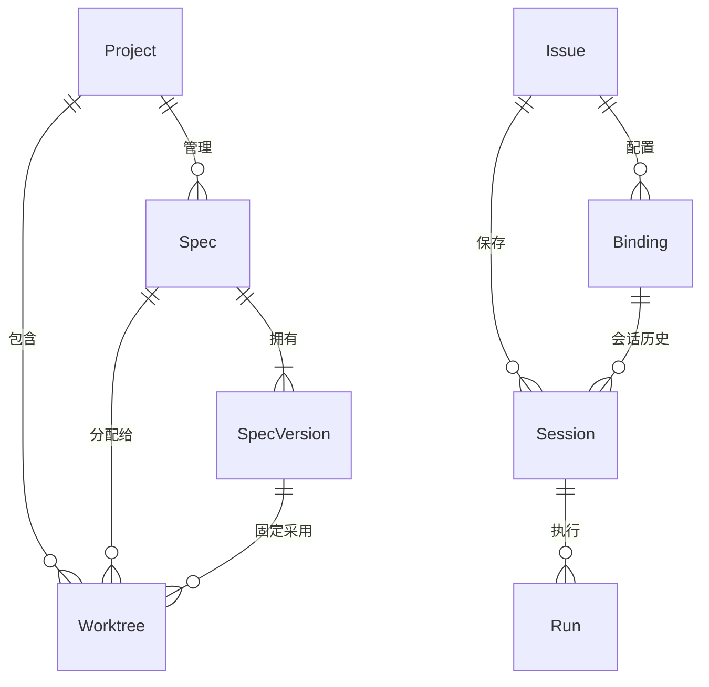
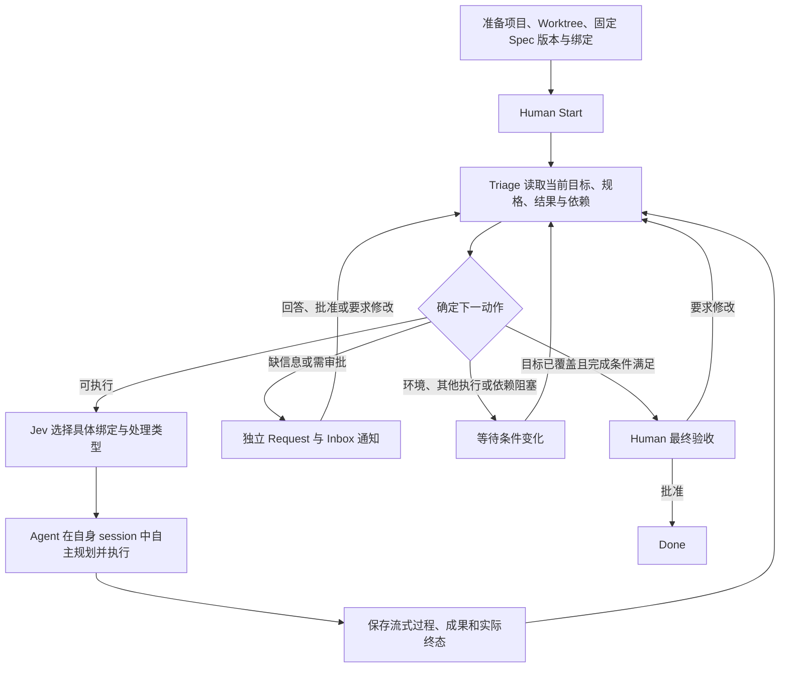
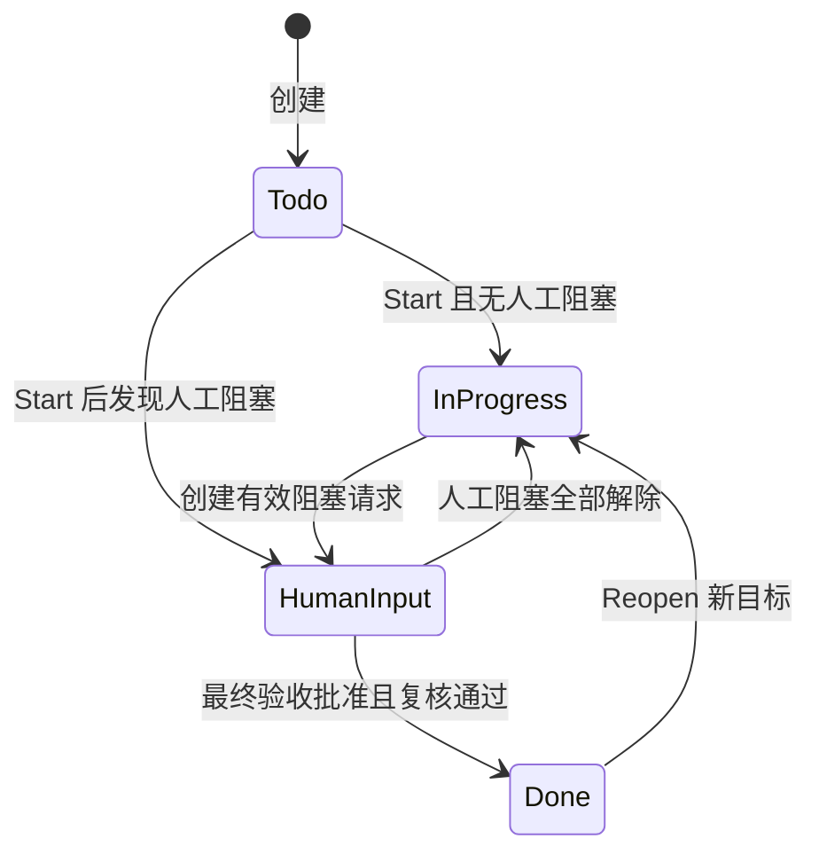

# PRODUCT — Relay 多 Agent 协同系统

> 版本：0.7 · 2026-10-04 · 当前产品契约。
> 行为以本文为准；实现契约见 [TECH](tech.md)。视觉依据为 /home/elliot/workspace/tmp/ui-design。

## 1. 概述与对象

用户为 Issue 配置工作范围，执行 Agent 自主规划与实施；Triage 在每轮结束后评估剩余目标、选择下一处理者。系统管理规格、共享上下文、审批、原生会话和实际过程。用户处理必要的决定，无需创建下一轮任务或搬运完整对话。

| 对象                 | 定义与关系                                                                        |
| -------------------- | --------------------------------------------------------------------------------- |
| Project              | 登记的 Git 项目；拥有多个 Worktree 和多个 Spec。                                  |
| Spec                 | 项目内独立、具有稳定 ID 的规格；包含 PRODUCT 和 TECH，由系统保存。                |
| SpecVersion          | 一组 PRODUCT / TECH 的不可变快照，保存来源与版本。                                |
| Worktree             | 已存在的真实工作目录；必须关联本项目的一个 Spec，并固定一个 SpecVersion。         |
| Issue                | 协作目标；保存绑定、自己的 session 集合、过程、成果和请求。                       |
| Binding / Assignment | Issue + Project + Worktree + Agent + Routing instructions；路由和会话隔离的单位。 |
| Session              | 某条绑定的原生会话；由所属 Issue 保存，执行记录引用实际使用的 session。           |
| Run                  | 一次实际执行；冻结目标、绑定、规格版本和输入，拥有独立过程及终态。                |
| 工作事项             | 需求、澄清或修订的持久记录，关联来源和依赖；由系统与 Agent 形成。                 |
| Request              | 澄清、审批或最终验收，具有明确对象、范围、状态和处理记录。                        |
| Artifact             | 固定的代码变更、契约、报告或验证证据，标明来源。                                  |
| Triage               | 系统的调度与判断过程；使用 Jev，不拥有执行 Agent 的原生会话。                     |

一个 Spec 可以暂未分配，也可以分配给多个 Worktree。同一 Issue 可涉及多个项目和目录。同一 Issue / Project / Worktree / Agent 仅有一条生效绑定；不同目录上的同一 Codex 或 Pi 使用独立 session。工具名称不规定业务职责。

## 2. 核心流转

开始、恢复、绑定变化、采用规格版本变化、执行终态、有效答复和审批决定触发重新评估。流式 token、工具进度、阅读、归档及草稿保存不触发新派发。暂停期间保存变化，恢复后评估最新事实。

普通评论进入共享上下文，不自动成为新任务或批准；目标纠正使用运行控制，Done 后新增工作使用 Reopen。

每轮 Agent 结束都回到 Triage。后续事项不是自动轮转的唯一来源；即使 Agent 未给出后续任务或最终 JSON，系统仍依据目标、原生结果和已有材料评估下一步。执行成功不等于需求完成，队列为空也不等于需求完成。

Jev 负责选择和判断；所选 Agent 根据完整上下文自行制定具体工作步骤。不是固定的 Codex → Pi 流水线，也不要求每条绑定都执行一遍。

### 2.1 Happy Path

1. 用户登记项目与已有 Worktree，在原有 Spec 字段选择或创建 Spec，明确固定版本。
2. 用户创建 Issue，配置绑定与职责说明，最后通过“…”选择 Start。
3. Triage 将规格规划工作交给合适绑定；Agent 阅读需求和系统规格，在自己的 session 中编写并提交新 SpecVersion。
4. 系统形成审批请求，明确 PRODUCT / TECH 的版本、拟执行范围及要升级的 Worktree 和原版本。
5. Human 批准。系统在同一次确认中记录批准并升级请求中列出的 Worktree；其他目录保持原固定版本。
6. Triage 重新检查条件并选择实现绑定。Agent 使用获批、已采用的版本实现与测试。
7. 每轮结束后 Triage 再评估；需要另一绑定维护契约、实现前端或回答问题时自动交接。
8. 目标覆盖与验证材料齐备后系统请求最终验收；Human 批准才进入 Done。

## 3. Issue 状态机与控制

### 3.1 主状态

| 状态        | 含义                                                                                          |
| ----------- | --------------------------------------------------------------------------------------------- |
| Todo        | 已创建，未 Start；可以准备配置。                                                              |
| In progress | 已 Start，尚未最终验收；没有有效的阻塞性 Human 请求。包含调度、执行、Agent 间等待及环境等待。 |
| Human input | 已 Start，存在需要 Human 处理的有效阻塞请求，包括 Spec 审批和最终验收。                       |
| Done        | 针对当前目标与材料的最终验收已由 Human 批准。                                                 |

主状态按 Todo → Human input / In progress 的规则派生，Done 只能由最终验收进入。暂停和运行异常另外记录，不增加页面的 Issue 状态选项。

图中的 InProgress、HumanInput 分别对应 UI 的 In progress、Human input；最终验收 Pending 时实际为 Human input。

| 当前状态 / 事件                             | 转换与处理                                                                              |
| ------------------------------------------- | --------------------------------------------------------------------------------------- |
| Todo / 保存绑定、编辑 Spec                  | 保持 Todo，不执行。                                                                     |
| Todo / Start                                | 启用自动推进；按当前条件进入 In progress 或 Human input。                               |
| 已开始 / 增加绑定、修复环境                 | 重新检查相关配置阻塞；条件已满足的配置请求自动解决，业务问题与审批仍须有效处理。        |
| In progress / Agent 成功结束                | 保存结果并触发 Triage；不能直接 Done。                                                  |
| 已开始 / 创建阻塞 Human 请求                | Human input；不受该请求影响的工作仍可串行推进。                                         |
| Human input / 回答或批准                    | 只解除对应依赖；有其他人工阻塞则保持，否则 In progress。暂停期间不派发。                |
| Human input / Request changes               | 保存意见，Triage 安排修订；原提案不得实现。若没有其他待处理人工请求，进入 In progress。 |
| 已开始 / 失败或结果未知                     | 保留目标与现场；需要人工核查时 Human input，否则 In progress 并显示等待原因。           |
| 已开始 / Pause、Stop、Resume                | 主状态仍按上述条件派生；修改自动推进控制。                                              |
| Human input / 批准最终验收                  | 复核当前目标、材料、版本和阻塞，成功才 Done；条件变化则拒绝过期确认。                   |
| Done / 普通评论、迟到结果、绑定或 Spec 变化 | 保持 Done，保留历史，不自动重开。                                                       |
| Done / Reopen                               | 保存明确的新目标，进入 In progress 且暂停；Resume 后重新评估。                          |

### 3.2 自动推进控制

控制仅位于现有“…”：Start、Pause、Resume、Stop and correct、Reopen。

| 操作             | 行为                                                                                                                                   |
| ---------------- | -------------------------------------------------------------------------------------------------------------------------------------- |
| Start            | 首次启用推进，创建需求来源事项；重复 Start 不重复创建。                                                                                |
| Pause            | 阻止新派发，已有执行可以继续；回答与审批仍可保存。                                                                                     |
| Stop and correct | 保存纠正意图并暂停派发，请求中止相关执行；确认终态后核查已有成果。纠正原目标，不把“stop”等控制文本原样派成新开发任务。                 |
| Resume           | 依据最新目标、绑定、固定版本、决定及现场继续；已确认的停止意图转为历史，不继续当作本轮停止指令。核查尚未完成或停止尚未确认时保持阻塞。 |
| Reopen           | 仅从 Done 接受非空的新目标；历史保留，不重跑全部步骤。                                                                                 |

停止不回滚文件。已确认的停止与失败可以在相关核查请求得到有效答复后重新评估，不因遗留的错误字符串永久卡住；明确的人工禁止不能被恢复操作覆盖。

### 3.3 完成条件

必须同时满足：当前目标已由成果覆盖、有可检查的验证说明、必需事项已解决、有效依赖已满足、无正在执行或结果未知的 Run、无活跃原生 turn，以及采用的实现依据具有当前范围的有效人工批准。

Triage 创建最终验收并冻结目标、成果和规格引用；普通 Spec approval 不完成 Issue。要求修改产生修订事项，修订完成后形成新的最终验收。材料或目标变化不能沿用旧批准。

## 4. 系统管理的 Spec

### 4.1 创建、编辑与版本

Spec 属于 Project。系统保存其原文、草稿和版本；Worktree 的同名本地文件不构成权威规格。项目详情通过 Worktree 的关联读取系统 Spec，PRODUCT 与 TECH 使用已有编辑区。

创建 Spec 同时生成初始版本，允许内容为空供规格规划使用。新 Worktree 必须选择本项目的 Spec 与版本；仅名称相同不能认定为同一 Spec。没有已批准、适用的版本时允许规格编写与澄清，禁止代码实现。

编辑修改 Spec 的共享草稿。关联同一个 Spec 的多个 Worktree 看到同一草稿；不同 Spec 的输入彼此隔离。自动保存由系统确认，保留未确认输入；并发编辑冲突不得覆盖。保存草稿不改变已发布版本、不升级 Worktree、不产生批准。

发布版本将 PRODUCT 与 TECH 一起冻结。执行 Agent 可提交版本与成果，系统负责持久化和审批；不要求 Human 在 Issue 手动发布。系统不自动把规格写入多个 Git 目录。

### 4.2 固定版本与人工升级

Worktree 保存明确的 SpecVersion，保持不变直到 Human 明确升级。新草稿或新版本出现不会使任何目录自动采用“最新”。

审批可明确请求“批准版本 V2，并将 W1、W2 从 V1 升级到 V2”；Human 一次批准完成这两个明确动作。请求必须展示两份原文、版本、授权范围及每个目标目录的当前版本。只批准 Spec 的请求不升级目录；未列出的 Worktree 不变。

确认时再次检查目录仍采用请求列出的原版本。目标目录有活跃执行、原生 turn 或未核查的未知运行时，不切换版本；请求保持可处理并说明阻塞。升级必须原子完成，不出现批准成功却部分目录仍未升级的结果。

升级影响所有引用该 Worktree 的未开始工作；这些 Issue 重新评估材料和审批范围。已完成运行保留旧快照。其他 Worktree 即使共享同一个 Spec，仍保持各自固定版本。

### 4.3 审批边界

每份用于代码实现的 SpecVersion 都必须获得 Human 对该版本、Issue 与工作范围的有效批准。旧版本批准不能授予新版本；另一个 Issue 的批准不自动授权当前 Issue。对同一 Issue 内已覆盖的目录和动作，无需重复批准。

初始空版本用于准备规格，不能作为实现的批准对象；送审必须包含可阅读的 PRODUCT 与 TECH 正文。

规格规划、读取、澄清与审查可以在批准前进行。授权合并、部署或其他外部写入需要明确动作范围；批准 Spec 本身不授予这些权限。编辑草稿不使固定版本上的有效批准自动失效。

## 5. 绑定与会话

Bind agent 保留 Agent、Project、Worktree、Routing instructions 四项。必须验证真实目录、Git 项目归属、分支、Spec 关联及非空说明。切换项目清除不属于新项目的目录选择。登记已有 Worktree，不创建分支、清空目录或重置代码。

说明只定义当前绑定的职责与边界，不能扩大目录权限或取消审批。保存第一条绑定不启动执行；开始后的绑定变化影响后续判断。

每条绑定拥有独立原生 session，存入所属 Issue 记录。首次派发按需建立；同一绑定后续执行复用它。新的一轮 Run 不等于新开 session，应用重启也不自动新开。

session 保存稳定身份、原生连接标识、所属绑定、目录和会话历史关系。Run 固定引用实际 session；更换 Agent 或目录须先停止核查旧执行，之后建立适配新范围的会话，历史不改写。只修改职责说明不重置会话。

本版保存支持以后新开 session 的会话历史结构，不增加该操作、按钮或列表展示。删除绑定停止新派发但保留会话和执行历史；未完成工作重新路由或明确取消。

Codex 使用 app-server，同一 session 可由本地 terminal 加入同一 thread；终端已执行时 Relay 等待，主动从终端开新 turn 前暂停 Relay。Pi 使用 1.0.0 RPC 和持久会话文件，RPC 停止后可由原生终端恢复；不承诺 Pi 活跃 RPC 可同时附着终端。

Assignments 显示 Ready、Running 或 Waiting。Ready 表示可接受新工作，不代表需求完成；Waiting 必须有原因。Issue 内最多一个活跃执行，同一实际目录跨 Issue 也避免竞争写入。

## 6. Triage 的输入、决定与恢复

Triage 使用同一事实快照判断：当前目标与纠正、绑定职责、各 Worktree 固定 Spec 原文、待审版本、已有成果和验证、未完成事项、有效决定、未决问题、最近执行结果，以及目录与 Agent 可用条件。Jev 不依赖原生会话历史，不接收密钥或 thinking。

动作分为：派发、等待、请求 Human、最终验收。派发时选择具体绑定和处理类型，如规格规划、实现、验证、澄清、修订或现场检查；执行 Agent 自主确定步骤。Jev 的判断不能绕过暂停、已知执行、固定版本或人工批准。

自动动作低置信度、无法匹配或判断相互矛盾时保留事实并提出有范围的人工请求，不随机选择第一个 Agent。final 仅提出人工验收，不再以动作置信不足重复要求澄清，目标覆盖与硬性条件仍须通过。暂时故障有限重试；待解请求和未变化的条件不反复调用 Jev、重复询问或生成执行。

配置阻塞与业务决定分开：新增有效绑定可自动解除“缺少绑定”，修复配置可解除对应环境等待；系统记录实际条件恢复，不冒充 Human 回答。业务疑问、规格批准和最终验收由对应有效答复或决定解决。

Agent 请求其他绑定解释问题时，原工作等待；Triage 路由关联问题，答案写回原请求，原工作在其他依赖满足后继续。无法由 Agent 处理时升级为同一个 Human 请求，不制造重复问题。

普通回答无需符合最终 JSON 模板即可返回 Triage。涉及发布 Spec、创建审批或回答特定问题的结构化操作必须校验对象与范围；格式错误保留原始回答及可检查结果，交回评估和补充，不抹掉已执行的事实或直接认定完成。

## 7. Agent 获得的上下文

每轮明确交给所选 Agent：

- 当前 Issue 的有效目标、纠正、验收要求和本次处理类型。
- 自身绑定职责、真实 Project / Worktree、其他有效绑定的工作范围。
- 当前固定 SpecVersion 的 PRODUCT / TECH 原文、来源；规格规划另附相关共享草稿和待审版本。
- 当前范围的有效人工决定、未决请求、依赖和剩余事项。
- 上游契约、代码变更、验证材料、最近结果及来源。
- Issue 评论、可用附件，以及自身 session 已有原生历史。
- 系统规格读取、提交版本、报告成果、提问及关联回答的可用方式。

其他 Agent 的完整原生对话不复制；必要事实通过上述共享材料交接。原生历史不能覆盖本轮明确的版本和授权。无法读取的附件或链接说明缺失并要求补充，不虚构内容。必要原文不被摘要代替；超出上下文容量时明确受阻。

## 8. 流式 Activity、Request 与 Inbox

### 8.1 一次执行一条 Activity

执行条目默认折叠，运行中持续更新；展开后按实际顺序展示工具调用、thinking、answer、成果与终态，不按每句话新增顶层记录。

| 内容     | 展示行为                                                                                               |
| -------- | ------------------------------------------------------------------------------------------------------ |
| Read …   | 实际读取调用，文件或对象、参数、进行状态与结果。                                                       |
| Exec …   | 实际命令调用、目录、输出、退出状态和失败。                                                             |
| 其他工具 | 使用真实工具名称和可读参数，保留调用与结果。                                                           |
| Thinking | 流式展示原生工具公开提供的 thinking；Codex 使用可读推理摘要，Pi 使用 thinking 事件。没有内容时不补造。 |
| Answer   | 流式拼接原生回答，结束时使用完整权威内容校正。                                                         |

工具调用、thinking 和 answer 可以交错。工具调用使用稳定调用 ID，消息使用稳定内容块标识；刷新与重连不重复追加。重试是不同 Run，原生会话内也按实际 turn 区分。

流式内容只表示过程；某句话、工具结束或消息结束均不能证明整轮完成。Codex 以对应 turn 终态，Pi 以 agent_settled 确认本轮不再自动继续。结束结果包括成功、失败、中止或未知。断线不能显示成功。

### 8.2 独立请求

输入与审批单独形成默认展开的 Request Activity，关联原 Run；请求状态、答案和决定更新同一条。业务审批、原生命令授权和最终验收相互独立。

| 请求状态            | 含义                                                                 |
| ------------------- | -------------------------------------------------------------------- |
| Pending             | 等待有效处理。                                                       |
| Answered            | 输入已回答，Triage 仍检查是否解决相关问题。                          |
| Approved            | Human 批准指定对象及动作。                                           |
| Changes requested   | Human 要求修改；允许修订，不允许原提案实施。                         |
| Resolved            | 系统核实配置恢复或原生执行的准确终态，保存依据；不是人工回答或批准。 |
| Resolved externally | 原生请求由终端等客户端处理，记录事实，不猜业务批准。                 |
| Superseded          | 对象、范围或版本被替代，旧请求不能再处理。                           |
| Cancelled           | 明确撤销；不代表获准执行。                                           |

审批必须关联冻结材料和动作；答案不得为空。路由选项可以提交绑定 ID 或完整说明；Agent 简称仅在当前候选中唯一时接受，歧义不猜测。Approve 与 Request changes 放在现有卡片，要求修改必须有意见。

Activity 与 Inbox 共享请求 ID 和结果。Inbox 的已读、归档不解决请求；通知处理成功后可归档。重复或并发决定只有首次有效提交生效，过期页面不能覆盖结果。取消审批保留授权阻塞，直到相关动作明确取消或出现有效替代决定。

Inbox 保留 Inbox / Archived 与 All / Triage / Review / Agent 筛选；实际打开通知才标已读，侧栏数量为未读且未归档通知数。

## 9. 边界与恢复

| 场景                                    | 行为                                                                       |
| --------------------------------------- | -------------------------------------------------------------------------- |
| 创建、保存或决定失败                    | 保留输入，同操作重试不重复创建。                                           |
| Spec 草稿并发修改                       | 返回当前版本和冲突，保留双方内容，人工或 Agent 明确修订后提交。            |
| 批准升级时目录版本已改变                | 拒绝过期确认，不部分升级，不沿用旧请求。                                   |
| 绑定、目标或批准范围在 Jev 判断期间变化 | 丢弃过期判断，基于新事实重新评估。                                         |
| Agent / Jev 不可用                      | 保留现场与等待原因；有限重试，恢复后检查当前进展。                         |
| 原生执行失联、启动确认丢失              | 保存未知状态和目录占用；恢复同一原生身份，不能盲目重发任务。               |
| 停止未确认                              | 保留停止意图，阻止替代执行；核实终态后继续。                               |
| 失败 / 无进展                           | 对照成果核查，允许获准的修复；重复无进展或权限错误转 Human，不能无限循环。 |
| 多个阻塞只解决一个                      | 仅更新对应依赖，不关闭其他请求。                                           |
| 审批时被替代                            | 历史保留，生成新对象及请求，旧批准不用于新材料。                           |
| 刷新、等待期间重启                      | 恢复 Issue 的 session、版本引用、过程及请求；未知副作用先核查。            |
| 迟到或重复终态                          | 保留可观察历史，不重复摄入、不重复派发、不重开 Done。                      |
| 流式内容暂时中断                        | 保留已确认内容，说明连接状态，恢复后补齐可读取的内容。                     |
| 输出或必要输入超限                      | 明确范围与缺失，不把截断内容显示为完整材料。                               |

保留次数、耗时和无进展保护，具体限制见 TECH。Agent 报告与实际观察的证据标明来源；没有执行的测试不显示通过。

## 10. UI 与范围

唯一视觉依据为 /home/elliot/workspace/tmp/ui-design。保留 Issues、Inbox、Projects / ProjectDetail、Agent、Settings、绑定弹窗和 Spec 编辑区；真实对象替换示例数据，不增加独立 Tasks、Artifacts 或 Session 面板。

已允许的交互：运行控制位于“…”；现有审批卡内批准 / 要求修改；原目录区域输入或选择真实目录；原 Spec 字段在同位置选择已有 Spec 或输入名称创建。升级审批使用已有请求卡展示明确版本与目标目录，不新增按钮。其他新入口仍需确认。

项目详情从 Worktree 关联打开共享 Spec，明确显示固定采用版本与正在编辑的草稿。草稿自动保存只使用现有状态位置；保存成功文案表示系统确认保存，不宣称已写入各 Git 目录。手动重新关联 Spec 或单独升级的服务契约见 TECH，不另加未经确认的 UI。

列表保持 Active / Backlog / All issues 及现有分组。Search 按编号、标题和关联项目去重；优先级 0–4、标签、评论、附件和复制现有编号 / 链接使用真实数据。New issue 支持 Create more。输入按所属对象隔离；主题和中英文偏好保留，用户正文不翻译。

Active 包含 Human input / In progress，Backlog 包含 Todo；按 Human input → In progress → Todo → Done 分组，组内按最近业务更新时间排列。流式 token 不改变此排序。

项目 Health 表示目录最近检查，不表示代码质量；Active issues 按 Issue 去重。Agent 的版本、响应时间和活跃执行数来自实际服务，不能把绑定数当运行数。Settings 保存 Jev key 并测试真实连接，密钥不进入共享上下文。

非目标：本轮不增加多人权限、流程画布、Git Worktree 自动创建、默认合并部署、完整移动端、不同 Agent 原生历史无损迁移，或新开 session 操作。

## 11. 验收场景

以下定义本版验收要求；实际验证范围单独记录，不因文档存在而宣称场景已通过。每项检查页面结果与持久记录；成功文案、Agent 自述和 mock 结果不能替代实际证据。技术验证与现有测试的调整边界见 [TECH §11](tech.md#11-验证)。

通用准备：一个真实 Git 项目、两个已存在的 Worktree W1 / W2、系统 Spec S，以及明确职责的绑定。场景注明未批准或空版本时，不预置实现授权；需要真实执行时使用已认证的 Codex app-server 或 Pi 1.0.0。

### 11.1 Spec 与批准

| 编号 | 前置条件与操作                                                                               | 预期结果                                                                                                                         |
| ---- | -------------------------------------------------------------------------------------------- | -------------------------------------------------------------------------------------------------------------------------------- |
| P01  | 项目内创建 S、另一个 Spec；W1 / W2 均选择 S，分别固定 V1 / V2。                              | 每个目录仅关联一个本项目 Spec；同一 Spec 可共享，固定版本独立，不随 latest 改变。                                                |
| P02  | 登记真实目录，分别提交缺 Spec、跨项目 Spec、错误分支及重复目录；再用原 Spec 字段创建新名称。 | 无效组合被拒绝且保留输入；有效创建同事务保存 Spec、初始版本和 Worktree，不创建 Git 目录 / 分支，不按同名合并。                   |
| P03  | 从 W1 编辑 S 草稿，再从 W2 查看；用旧草稿 revision 保存，并改变目录中的同名文件。            | 共享草稿来自系统，文件变化不改正文；冲突保留输入和当前草稿，已发布原文与固定版本不变。                                           |
| P04  | 使用空版本或未批准版本执行规格规划，再尝试代码写入 / 未批准的测试轮次；批准后再派发实现。    | 批准前可读与提交系统规格，代码实施工具受限；空版本不能送实施审批，批准后仅开放明确目录和动作。                                   |
| P05  | 审批明确“批准 V2，W1 从 V1 升级到 V2”，提交批准；另测原版本已变、目标目录忙或结果未知。      | 正常时批准与 W1 升级一起提交，W2 不变，引用 W1 的 Issue 重评估；冲突时整体拒绝、请求保持 Pending，旧 Run 快照保留。              |
| P23  | 对 V2 要求修改，Agent 提交 V3；另测仅批准 V3、仅升级 pin、另一 Issue 的批准及编辑无关草稿。  | 修改意见形成修订和新审批，V2 不得实施；单独批准不升级、单独升级不授权，批准不跨版本 / Issue / 范围；无关草稿不撤销有效版本批准。 |

### 11.2 自动流转与 Issue 状态

| 编号 | 前置条件与操作                                                                                                            | 预期结果                                                                                                                                |
| ---- | ------------------------------------------------------------------------------------------------------------------------- | --------------------------------------------------------------------------------------------------------------------------------------- |
| P06  | 保存多个绑定但不 Start；Start 后让 Agent 只返回自然语言和实际结果，不提供 tasks 或最终 JSON。                             | 准备期间 Todo 且无执行；每轮终态自动回到 Triage，根据剩余目标推进，不因缺 JSON 永久卡住，也不因空队列验收。                             |
| P07  | Start 时缺绑定，随后补齐；另测等待目录或 Agent 恢复，并保留一个业务审批。                                                 | 对应配置等待根据真实条件解除，Triage 重评估；业务审批仍待明确决定，不被配置恢复一起关闭。                                               |
| P08  | 运行中 Pause，保存答案或批准，等待本轮结束，再 Resume。                                                                   | Pause 不强制结束已有运行，后续不派发；决定持久保存，Resume 按最新事实推进，暂停本身不增加主状态。                                       |
| P09  | Agent 成功退出但目标有缺口；补齐后进入最终验收，先要求修改，再批准新的最终请求；另测材料变化后的旧确认。                  | 有缺口不验收；最终请求 Pending 时 Human input，修订回 In progress；新请求复核通过才 Done，自身 Pending 不阻塞批准，旧材料的确认被拒绝。 |
| P16  | W1 绑定向 W2 绑定请求澄清，同时原工作还有独立审批；W2 回答原 requestId，另测无法匹配处理者。                              | 答案关联原问题并回到 Triage，只解除对应依赖；其他审批保留。无法匹配时同一请求转 Human，不复制问题或扩大目录权限。                       |
| P19  | Done 后收到迟到结果、评论或 Spec 变化；随后 Reopen 提交明确新目标并 Resume。                                              | Done 不自动重开；Reopen 保留历史、进入暂停的 In progress，Resume 才推进新目标，不重跑全部历史。                                         |
| P21  | 从空 S 和两个职责不同的绑定开始：Start → Agent 规划并提交版本 → Human 明确批准及升级 → 自动实现 / 验证 → Human 最终验收。 | 全流程无需手工提交下一任务或搬运回答；执行者自主规划，具体绑定按实际职责选择，每轮回 Triage；规格批准后仍非 Done，最终验收后才 Done。   |
| P22  | 当前 Issue 已有覆盖准确版本、目录和动作的有效批准；Start 时需求可直接实现，且有一条不相关绑定。                           | 根据已有材料选择下一动作，不强制再写一版 Spec、不强制所有 Agent 依次执行；实现使用已固定版本及原文。                                    |
| P25  | 运行中 Stop and correct 提交业务纠正；停止确认或未确认时分别 Resume。                                                     | 保存纠正、请求原生中止，不回滚文件；未确认不启动替代运行，确认并核查后可恢复，旧 stop 指令不再派成开发任务。                            |
| P26  | 在等待审批 / 环境恢复时反复轮询、刷新或重启，再满足等待条件；另测仅新增 token、阅读或归档。                               | 未变化事实不重复询问 Jev、发请求或执行；条件满足后恢复持久触发，过程增量及通知操作不创建新执行。                                        |
| P29  | Jev 暂时故障、认证失败，或 Agent 失败 / 连续无进展；修复条件后恢复。                                                      | 有限重试与等待原因可查，重复无进展转 Human；不以错误文案永久阻塞，不自动重放未知副作用，不把未执行测试显示为通过。                      |

### 11.3 判断、上下文与会话

| 编号 | 前置条件与操作                                                                                              | 预期结果                                                                                                                                      |
| ---- | ----------------------------------------------------------------------------------------------------------- | --------------------------------------------------------------------------------------------------------------------------------------------- |
| P10  | 同一 Issue 的 W1 / W2 绑定相同 Agent，连续执行并重启；另一 Issue 也绑定相同 Agent。                         | 每条绑定独立 session，保存于所属 Issue；本绑定复用准确原生身份，跨绑定 / Issue 不共享，历史 Run 可定位，无新 session 展示或操作。             |
| P11  | 检查实际 Jev 请求与 typed 响应；返回低置信、无效候选、矛盾判断；请求期间改变目标、绑定或 pin。              | 输入包含当前目标、绑定职责、固定规格和证据；坏响应不派发、过期判断丢弃；选择具体绑定而非工具名，不编造 Jev 的解释或问题正文。                 |
| P12  | 接手绑定有旧原生历史，系统已采用另一明确版本；上游有成果、评论、附件和关联问题，另测缺失 / 超容量材料。     | 本轮获得准确原文、版本、权限、问题与证据，自身历史复用但不覆盖当前输入；不复制其他 Agent 完整对话，不传 thinking 或密钥，缺失不冒作已阅读。   |
| P17  | 原生启动确认丢失、断线或停止未确认时重启；分别恢复到仍活跃、明确终态与记录缺失。                            | 保留 unknown 和现场占用，按准确 session / turn 核查；活跃继续监听、终态只摄入一次、缺失仍等待，不重发 prompt 或无依据解锁。                   |
| P18  | 同 Issue 准备两个执行、跨 Issue 使用同一真实目录；终端加入同一 Codex thread 并在 Relay 暂停后启动 turn。    | 平台执行串行且真实目录互斥；终端可读相同历史，终端忙时 Relay 等待，其独立 turn 不冒作平台交付；Pi 只验收 RPC 退出后恢复相同文件。             |
| P24  | Agent 用系统工具提交 Spec / 成果 / 关联答案，再重送相同调用；另测错误版本、无关 requestId、非法批准或升级。 | 合法操作原子持久化，同调用不重复创建；非法报告无部分应用，原生回答和已发生工具事实仍保留并交回 Triage，不授予 Agent 人工决定权。              |
| P27  | 修改职责、移除绑定或更换 Agent / 目录；另测旧执行尚未停止。                                                 | 改职责复用 session；移除后不再派发且历史保留；换范围先核查，再归档旧 session 建新记录，旧 Run 引用不变，不暴露手动新开功能。                  |
| P28  | 停止服务并清空应用 SQLite，用新库重新启动；另测未清理的旧 schema。                                          | 项目、Worktree、Spec、Issue、会话关联、批准与过程从空状态开始；保留独立密钥和原生历史，不自动重新绑定。旧 schema 明确拒绝启动，不做兼容迁移。 |

### 11.4 流式展示、请求与界面

| 编号 | 前置条件与操作                                                                                                | 预期结果                                                                                                                                            |
| ---- | ------------------------------------------------------------------------------------------------------------- | --------------------------------------------------------------------------------------------------------------------------------------------------- |
| P13  | 一轮实际交错输出 Read、Exec、thinking、answer，并在运行中展开 / 收起 Activity。                               | 顶层始终一条执行，展开区按实际顺序流式更新工具参数、输出、状态与文本；不按句新增记录，不混合调用 ID，新流不改变用户展开状态。                       |
| P14  | 工具 / 消息先结束但整轮未结束；随后重连、重复终态、取得完整权威消息；另测无 thinking 或超限事件。             | 等真正原生终态才结束 Run，刷新补齐不丢失 / 重复，最终内容校正而非再追加；没有内容不补造，截断标明且不能当完整验收证据。                             |
| P15  | 从 Activity / Inbox 处理同一请求，另测并发决定、归档、取消及终端处理原生审批；填写唯一或有歧义的 Agent 简称。 | 请求独立展开、两个入口同结果，只有首次有效决定生效；归档 / 取消 / 原生批准不代替业务批准；唯一简称解析准确，歧义保留输入并要求完整选项。            |
| P20  | 按同一桌面视口核对设计全部页面与弹窗，再操作 Spec 字段、审批卡、目录选择、搜索、评论、附件、偏好及统计。      | 布局与原设计一致，仅有已批准例外；无手工任务 / 成果按钮或新面板，真实数据持久保存、跨对象输入隔离，偏好保留且用户正文不翻译，token 不改变列表排序。 |
| P30  | 浏览器同源提交并重试同一次操作；检查公开 API、Jev / Agent 输入和流式载荷，再提交跨源写入或同键异请求。        | 同源写入成功且重试不重复，跨源与同键异请求拒绝；密钥不外泄，输入 / 输出超限明确提示而非静默裁掉必要材料。                                           |
