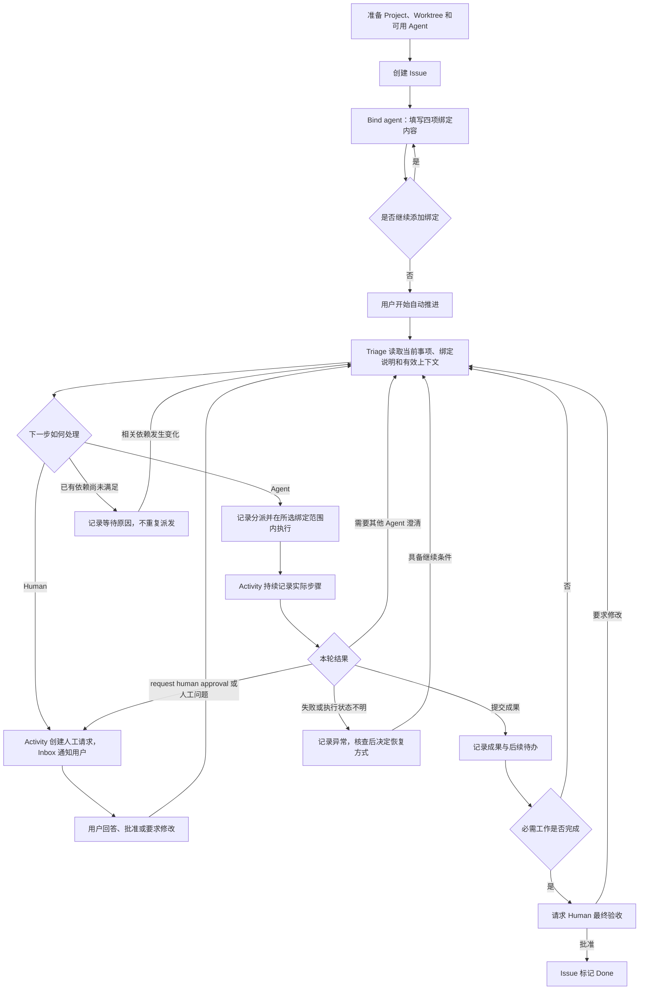
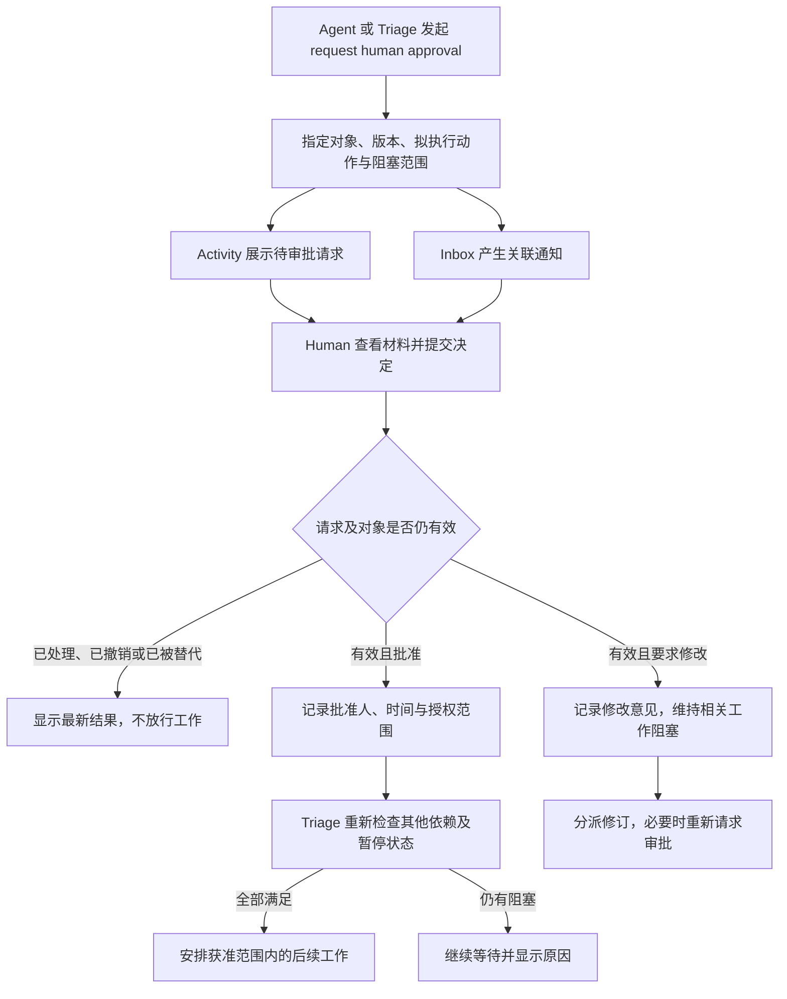

# PRODUCT — 多 Agent 协同系统

> 页面标识：Relay  
> 所属项目：Catcoon  
> 文档版本：0.5\
> 更新日期：2026-10-03  
> 交互依据：`/home/elliot/workspace/tmp/ui-design/src/App.tsx` 与 `src/index.css`，以及 Issue 绑定、Triage 路由和 Activity 的产品要求。
> 范围：用户、Agent 及外部系统能够观察到的能力、交互、业务规则、失败行为与验收条件。

## 1. 概述

### 1.1 产品目标

用户围绕一个开发需求，使用多个 Agent 编写规格、实现代码、维护接口文档并处理相互之间的问题。系统负责交接上下文、转达问题和推动下一步，避免用户在各个 Agent 窗口之间反复复制粘贴。

产品以 **Issue** 组织协作。用户在 Issue 中通过 **Bind agent** 建立绑定：

**Project + Worktree + Agent + Agent description。**

Triage 根据 Issue 当前需要处理的事项、各条绑定中的 description、工作范围和实际可用条件，决定交给某条 Agent 绑定处理，或请求 **Human** 作答、审批或裁决。整个过程统一记录在 **Activity** 中。

### 1.2 核心模型

一个 Issue 可以包含多条 Agent 绑定。每条绑定同时回答四个问题：

| 绑定内容          | 回答的问题                                            |
| ----------------- | ----------------------------------------------------- |
| Project           | 在哪个项目中工作？                                    |
| Worktree          | 使用该项目的哪个工作目录和分支？                      |
| Agent             | 由哪个已接入的 Agent 执行？                           |
| Agent description | 这个 Agent 在当前 Issue、当前工作范围内应该处理什么？ |

`Agent description` 在 UI 中显示为 **Routing instructions**。本文的 description 均指绑定中的这项说明，不是 Issue 描述，也不是 Agent 的全局宣传介绍。

**Assignments 是当前 Issue 的绑定列表；Bind agent 是添加一条绑定的操作，两者不是两套分派关系。** 用户不需要先单独添加项目分派，再为项目配置执行者。

本产品不设置角色、角色模板或继承关系。Codex、Pi 等名称标识执行工具，不预设后端、前端或文档职责；同一个 Agent 可以通过不同绑定处理不同范围的工作。

Human 是人工处理入口，不是需要选择 Project、Worktree 并注册的 Agent。Triage 本身也不作为一条普通绑定。

### 1.3 规格约定

本文以新版 UI 的信息结构、字段和入口为基线，定义应实现的产品行为。原型中的示例 Issue、项目、状态、版本、统计、时间和 Activity 文本不构成真实执行结果。

尚未在 UI 中展开的审批联动、绑定修改、开始与停止等交互，在第 17 节单独列出。该节也标明为使闭环完整而采用的首版默认规则，首版采用该节全部默认规则。

本文不规定技术栈、数据库结构、通信协议、接口路径或部署方式。这些属于 [技术规格](tech.md)。

## 2. 页面结构与产品对象

### 2.1 页面结构

| 入口        | 主要内容                                             | 用户目的                                        |
| ----------- | ---------------------------------------------------- | ----------------------------------------------- |
| Search      | 按编号、标题和关联项目检索 Issue                     | 找到需求及其进展。                              |
| New issue   | 标题、描述、附件入口、Create more                    | 创建需求。                                      |
| Issues      | Active、Backlog、All issues，按状态分组              | 浏览需求并进入详情。                            |
| Issue 详情  | 需求正文、Activity、评论、Properties、Assignments    | 查看全过程、绑定 Agent、处理请求。              |
| Bind agent  | Agent、Project、Worktree、Routing instructions | 为当前 Issue 指定执行工具、工作范围和处理说明。 |
| Inbox       | 通知列表、请求详情、Archived                         | 集中处理人工问题与审批。                        |
| Agent       | Service、Status、Version、Active runs、Heartbeat     | 查看已接入 Agent 的可用情况。                   |
| Projects    | 项目目录与状态、New project                          | 登记和访问开发项目。                            |
| 项目详情    | Worktrees、New worktree、Bound spec                  | 管理工作目录及其规格。                          |
| Spec 编辑区 | PRODUCT.md、TECH.md                                  | 编辑当前 Worktree 对应的文档。                  |
| Settings    | Jev API key、保存与连接测试                          | 配置 Triage 所需的服务访问。                    |
| 侧栏底部    | 主题与语言切换                                       | 设置界面偏好。                                  |

Issue 详情右侧使用 **Assignments**。执行进度在绑定条目和 Activity 中展示，不要求用户再维护一份独立的 Agent runs 分派列表。

### 2.2 产品对象

| 对象                       | 产品含义                                                                                |
| -------------------------- | --------------------------------------------------------------------------------------- |
| Issue                      | 一项协作需求，保存目标、绑定、过程、成果和请求。                                        |
| Project                    | 已登记的开发项目，关联执行环境可访问的仓库位置。                                        |
| Worktree                   | 属于某个 Project 的具体工作目录，展示名称、分支、路径和 Bound spec。                    |
| Agent                      | 已接入的执行工具或服务，例如 Codex、Pi；它的可用性与其在某个 Issue 中处理什么是两回事。 |
| Agent binding / Assignment | 当前 Issue 中一组 Project、Worktree、Agent 和 description 的绑定。                      |
| 执行记录                   | 某条绑定处理某项具体工作的一次执行，保存当时的工作范围、输入、步骤和结果。              |
| Activity                   | Issue 的统一过程记录，包含分派、执行步骤、交接、等待、请求和人工决定。                  |
| Request                    | 有明确问题或审批对象、处理者、状态和结果的待处理请求。                                  |
| Human                      | 负责人工回答、审批、纠正及验收的用户。                                                  |
| Spec / 成果                | 可读取、可引用的规格版本、接口契约、代码变更、测试结果或其他材料。                      |
| Inbox 通知                 | 指向某个请求或需关注事件的入口，不是请求本身。                                          |
| Triage                     | 根据当前事实和绑定说明，选择下一项工作的处理者或等待条件。                              |

一个 Project 可以有多个 Worktree。一个 Issue 可以涉及多个 Project，也可以在同一 Project 下使用不同 Worktree。工作范围由每条绑定分别确定，不设置“Issue 对每个 Project 只能有一个 Worktree”的限制。

## 3. 流程图

### 3.1 Issue 协作流程



首次通过明确的“开始”操作启动、默认要求最终人工验收，是本稿采用的首版默认规则，见第 17.2 节。准备绑定期间不得因用户刚保存第一条绑定，就抢先执行尚未确认的工作。

流程不是固定的“后端 → 文档 → 前端”流水线。后续处理者由实际任务和 description 决定；暂停期间的答复和状态变化只保存记录，不自动启动新执行。

### 3.2 人工审批流程



Human approval 必须由 Human 决定。Triage 可以安排 Agent 整理审批材料或执行修订，不能把审批请求转给另一个 Agent，并将其答复当作人工批准。

## 4. Happy Path

以下用同一需求涉及后端、接口文档与前端的情形说明完整流程。表内说明是用户为绑定填写的示例，不是系统内置职责。

| 步骤 | 操作                                                                                              | 可观察结果                                                                        |
| ---- | ------------------------------------------------------------------------------------------------- | --------------------------------------------------------------------------------- |
| 1    | 用户登记后端和前端 Project，分别准备 Worktree 与 Spec。                                           | 项目详情展示实际目录、分支和对应文档。                                            |
| 2    | 用户确认 Codex、Pi 可用，并配置 Triage 服务访问。                                                 | Agent 页面显示真实状态；Settings 显示实际连接检查结果。                           |
| 3    | 用户填写 Issue 标题和需求，点击 Create issue。                                                    | 创建唯一 Issue，初始为 Todo，Activity 记录创建，Assignments 显示 No assignments。 |
| 4    | 用户绑定“后端 Project + 后端 Worktree + Codex”，说明为“编写和澄清规格，获批后实现后端及测试”。    | Assignments 展示完整绑定和说明。                                                  |
| 5    | 用户绑定“后端 Project + 后端 Worktree + Pi”，说明为“根据后端变化整理接口契约，回答接口文档问题”。 | 新增独立绑定；不会继承 Codex 的处理说明。                                         |
| 6    | 用户绑定“前端 Project + 前端 Worktree + Pi”，说明为“依据获准规格和接口契约实现前端”。             | 同一个 Pi 可以出现在两个绑定中，项目、Worktree 和 description 可区分。            |
| 7    | 用户开始自动推进，Triage 将规格工作交给对应的 Codex 绑定。                                        | Activity 记录分派依据、具体任务、目标项目、Worktree 及实际开始事件。              |
| 8    | Codex 执行并发布规格版本，发起 request human approval。                                           | Activity 展示执行步骤和审批请求；相关实现等待，Inbox 出现待审批通知。             |
| 9    | 用户打开确定版本，点击 Approve。                                                                  | 人工决定写回同一请求；符合条件的后端实现随后开始。                                |
| 10   | Codex 提交后端变更和测试结果，Triage 交给后端 Worktree 上的 Pi 维护接口契约。                     | 前后两次执行与交接均可追踪，外部文档更新的实际结果可查看。                        |
| 11   | Triage 将可读取的接口契约及规格交给前端 Worktree 上的 Pi。                                        | 前端按自己的绑定范围执行，Activity 展示步骤及成果。                               |
| 12   | 必需工作完成，系统发起明确标为最终验收的请求，用户批准。                                          | Issue 进入 Done，不再自动派发；所有绑定历史、成果及审批继续可查看。               |

用户不需要在第 7—12 步之间手动复制完整 Agent 会话。绑定成功不等于执行已经开始；某次执行结束不等于 Issue 完成；规格保存不等于审批通过。

## 5. Issues 与创建 Issue

### 5.1 Issues 列表

| 视图       | 包含内容                               |
| ---------- | -------------------------------------- |
| Active     | Human input、In progress。             |
| Backlog    | Todo。                                 |
| All issues | Todo、In progress、Human input、Done。 |

列表按 `Human input → In progress → Todo → Done` 分组，显示组内数量；组内按最近业务活动时间排列。空视图展示空状态。

每行展示编号、状态、标题、参与 Agent 摘要和更新时间。Agent 摘要来自该 Issue 的实际绑定；多个绑定使用同一 Agent 时，详情仍须完整展示，不能让用户误认为只有一个工作范围。

打开任何一条 Issue，都必须读取该 Issue 自己的正文、Assignments、Activity 和请求，不能复用示例 Issue 的固定记录。浏览、心跳和逐 token 输出不刷新“最近业务活动”时间。

### 5.2 New issue

| 字段或操作       | 行为                                                                 |
| ---------------- | -------------------------------------------------------------------- |
| Issue title      | 必填，去除首尾空白后不可为空。                                       |
| Add description… | 可选，支持多行需求与验收要求。信息不足时后续澄清，不自行补造。       |
| 附件入口         | 关联需求材料，并显示获取是否成功；不将尚未上传完成的材料交给 Agent。 |
| 展开 / 收起      | 只改变编辑空间，不清空内容。                                         |
| Create more      | 成功后清空当前内容并保持弹窗；未开启时进入新 Issue 详情。            |
| Create issue     | 防止重复提交；失败时保留输入并说明原因。                             |
| 关闭             | 有未提交内容时保留草稿或提示确认。                                   |

创建弹窗不强制加入新版 UI 中不存在的绑定必填字段。用户先创建 Issue，再在详情中通过 Bind agent 配置；创建入口来自哪个状态分组，都不改变新 Issue 从 Todo 开始的规则。

没有绑定时显示 `No assignments`，不自动绑定示例中的 ab-gateway、Codex 或任何默认目录。需要补充绑定时显示操作引导，而不是虚构已分派任务。

### 5.3 详情布局

主内容为标题、需求、附件、Activity 和评论；右侧为 Properties、Labels、Assignments 和 Created。

Properties 中的 Human 表示人工责任方，不随 Triage 派发到某个 Agent 而改变。Created 显示真实时间。尚未展开的优先级、标签和子 Issue 入口不影响核心路由规则。

顶部保留复制与更多操作位置。项目与工作目录统一在 Bind agent 中选择；菜单中尚未展开的行为见第 17 节。

Issue 详情不提供 Submit task、Publish artifact、Request approval、Request human input 四个手工创建入口，也不在更多菜单中提供这些入口。用户配置需求与绑定后通过 Start 开始；后续任务、成果及请求由 Agent 交接和系统调度自动形成，Triage 根据有效上下文选择下一条绑定。用户在 Activity 或 Inbox 回答已有问题、批准或要求修改，以及在必要时暂停、恢复、停止并纠正；无需手工搬运成果或创建下一轮任务。

## 6. Bind agent 与 Assignments

### 6.1 绑定表单

用户在当前 Issue 的 Assignments 区点击 **Bind agent** 打开表单。

| 字段                       | 产品规则                                                                            |
| -------------------------- | ----------------------------------------------------------------------------------- |
| Agent                      | 必选，从已接入的 Agent 中选择；当前原型展示 Codex、Pi，不表示产品只能有这两个工具。 |
| Project                    | 必选，从已登记项目中选择。                                                          |
| Worktree                   | 必选，只显示当前 Project 下的 Worktree。                                            |
| Routing instructions | 必填，多行文本；去除首尾空白后不可为空，说明当前绑定应处理的工作与边界。            |
| Cancel / 关闭              | 不生成绑定，不启动执行。                                                            |
| Bind agent                 | 校验通过后保存整条绑定并关闭弹窗，更新当前 Issue 的 Assignments 与 Activity。       |

切换 Project 时必须清除上一项目的 Worktree 选择，或明确选中并展示新项目的有效默认项，不能提交一个属于其他项目的旧 Worktree。

没有 Project、所选项目没有 Worktree，或必填项不完整时不能提交。无 Worktree 时显示 `No worktrees in this project` 并提供前往项目管理的路径；不能退回项目根目录执行。

保存前必须验证 Project 与 Worktree 的归属关系。只有目录显示名、找不到实际位置或关联已失效时，不能宣告绑定已具备执行条件。

已登记 Agent 暂时不可用时可以保留绑定配置，但必须展示 Waiting 及原因，禁止启动执行；未接入或无法识别的 Agent 不能作为有效选项。保存绑定与确认 Agent 可执行是两个不同结果。

### 6.2 description 的含义

description 的适用范围仅为 **当前 Issue 的当前绑定**。它参与后续初始分派、成果交接、问题转发、返工和异常处理的路由判断。

建议描述具体工作对象、工作边界和必要交接条件，例如：

> 负责当前后端 Worktree 的规格澄清、接口实现和测试；根据已批准规格执行，不修改前端项目。接口有变动时提交变更说明，供文档维护工作接手。

description 不要求采用模板或固定命名，也不要求使用“后端 Agent”等称呼。系统不得仅凭 Codex、Pi 的名称决定其职责。

description 不是权限授权：写入“可以访问所有项目”不会扩大绑定范围；写入“无需审批”不能取消已经设置或明确请求的人工审批。文本描述与已有需求或人工决定冲突时，Triage 应请求澄清。

### 6.3 多条绑定

一个 Issue 可绑定多个 Agent，也可多次使用同一个 Agent，只要工作范围能够区分。一个 Project 可在同一 Issue 中出现多个 Worktree，不自动将它们合并。

本稿首版默认：同一 Issue 中，**同一 Project + Worktree + Agent 保留一条生效绑定**；需要补充处理说明时编辑该绑定。该唯一性规则采用默认规则，见第 17.2 节。不同 Issue 之间不共享 description，不因使用同一 Agent 而联动修改。

重复点击同一次保存不得生成重复绑定。绑定数量不等于运行数量，多条绑定不表示应同时启动全部 Agent。

### 6.4 Assignments 展示

每条绑定展示 Project、Worktree / 分支、Agent、description 与当前状态。可保持原型中的紧凑布局；被截断的说明必须能够完整查看，执行前能查看实际工作目录。

| 状态    | 含义                                                                               |
| ------- | ---------------------------------------------------------------------------------- |
| Ready   | 当前绑定没有已知执行阻塞，可接受符合范围的新任务；不表示已经执行或已经完成 Issue。 |
| Running | 该绑定存在已确认启动、尚未结束的执行。                                             |
| Waiting | 已有待处理工作被输入、审批、上游成果、环境可用性或其他条件阻塞；必须显示具体原因。 |

等待调度的工作显示其排队情况，不计为实际运行。执行完成后可回到 Ready，同时显示最近执行结果；失败或状态不明时显示明确异常原因，不把失败伪装成 Ready。

绑定条目按设计展示，运行信息及完整历史通过 Activity 访问。一个绑定的状态不能代表同一 Agent 在所有 Issue 中的全局状态。

### 6.5 修改、替换与移除

绑定修改、替换、移除通过既有 API 完成；新 UI 未提供相应入口，不自行增加。

| 修改                    | 必须发生的行为                                                                   |
| ----------------------- | -------------------------------------------------------------------------------- |
| 修改 description        | 仅影响当前绑定后续路由；保存变更摘要至 Activity。                                |
| 更换 Agent              | 保留当前 Issue 的工作上下文，校验新 Agent 能否访问所需工作范围与材料。           |
| 更换 Project / Worktree | 重新校验归属和目录；显式提示哪些任务、材料或请求受到影响。                       |
| 移除绑定                | 停止向它分派新任务，保留历史执行、成果和人工决定；未完成工作必须转交或明确取消。 |

默认后续执行使用新配置。已经开始的执行仍按当时配置运行，界面明确标识其使用旧配置；不能在运行过程中悄悄改变其目录、Agent 或指令。尚未开始但受变更影响的旧安排应取消并重新评估，不直接沿用旧分派。

需要立即切换时，先“停止当前执行并调整”；确认停止并核查已有成果后，再安排新执行。停止请求发出但尚未确认时，不得启动替代执行。

新的 Agent 从 Issue 的有效需求、成果、人工决定、未完成事项及工作现场接手，不假设不同 Agent 的原生会话能够直接迁移。

所有历史记录保留执行当时的 Project、Worktree、Agent 和 description。绑定后来改动，不得让旧的 Codex 执行在历史中变成 Pi，也不得把旧目录替换成新目录。

修改绑定本身不自动撤销对同一对象、同一范围的有效业务批准；但审批范围或拟执行动作已发生变化时，必须重新检查，必要时重新请求 Human。

## 7. Triage 路由

### 7.1 路由到具体绑定或 Human

Triage 的 Agent 处理目标是 **当前 Issue 中的一条具体绑定**，不是脱离 Project、Worktree 的 Agent 名称。

例如，Pi 同时绑定后端文档工作和前端实现工作时，Triage 必须说明选中了哪条绑定；不能只记录“交给 Pi”，再由执行工具猜工作目录。

每次路由结合以下事实：当前待处理事项与来源、Issue 目标及验收条件、绑定的 description 和工作范围、相关成果、有效人工决定、现有任务及未决请求、Agent 与目录可用情况。

### 7.2 可产生的结果

| 路由结果              | 适用情形                                                                   | 用户可见信息                                         |
| --------------------- | -------------------------------------------------------------------------- | ---------------------------------------------------- |
| 分派给 Agent 绑定     | 工作符合该 description，且范围、材料和前置条件满足。                       | 本次任务、目标绑定、简要选择依据及输入材料。         |
| 请求 Human 澄清或裁决 | 业务规则未确定、说明冲突、没有合适绑定、无法确定下一步，或需要用户补配置。 | 原问题、为何需人工处理、需要提供的信息及受影响工作。 |
| 请求 Human approval   | 需要批准具体文档、动作、成果或最终验收。                                   | 审批对象、版本、范围和批准后的后续动作。             |
| 等待                  | 对应任务已经在执行、已有请求尚未解决，或依赖尚未就绪。                     | 等待什么、关联哪个任务或请求。                       |
| 无需新动作            | 事项已解决、记录仅用于参考，或 Issue 已完成。                              | 不重复派发；必要时记录检查结论。                     |

description 不能独立决定一切。一个说明匹配但缺少目录权限的绑定不能执行；明确需要 Human approval 的事项也不能因另一个 description 写了“负责审查”而交给 Agent 自动批准。

### 7.3 触发与去重

开始或恢复 Issue、有效绑定变更、Agent 交接中的后续任务与成果、执行结果、请求答复或审批决定，可以触发重新评估。

普通评论进入共享上下文，但不自动成为已批准的变更指令；需要纠正当前目标时，用户应通过停止并纠正操作提交；已完成需求使用重新打开提交新目标。阅读、通知已读、归档、心跳、每条 token 和草稿自动保存，不自动创建新执行。

每项工作都必须能够追溯到具体需求、问题、决定或交接。相同事项正在处理或相同请求已在等待时，不重复分派、不重复向用户提问。

开始执行前再次检查目标绑定和前置条件。Triage 判断后，如果 description、工作范围、审批对象或 Issue 状态已经改变，不能继续执行过期的安排。

### 7.4 反向协作

前端工作发现接口字段不明确时，应将所用契约、实际问题和预期用途写入 Issue。Triage 可以交给负责接口实现的绑定、负责文档的绑定，或 Human。

回答关联原请求，并明确是解释已有事实、修正文档，还是需要修改接口。原任务只有在该请求及其他依赖均满足后才能继续；不能收到任何一条普通评论就恢复。

跨项目传递的是授权读取的资料与问题，不是自动转移工作目录写权限。Agent 需要修改绑定范围之外的项目时，应请求新增或调整绑定。

## 8. Activity：记录每一步过程

### 8.1 记录范围

Activity 是查看 Issue 全过程的主入口，不只展示最后一句结果或最终的成功／失败状态。

| 步骤类别    | 至少记录的内容                                                      |
| ----------- | ------------------------------------------------------------------- |
| Issue 操作  | 创建、需求修订、开始、暂停、恢复、完成、重新打开。                  |
| 绑定操作    | 添加、修改、替换 Agent、移除；包括实际四项绑定内容及变更摘要。      |
| Triage 处理 | 触发事项、分派／等待／请求 Human 的结果、简要依据与关联工作。       |
| 任务安排    | 准备分派、排队、实际开始；不能把计划展示成已执行。                  |
| 执行步骤    | Agent 报告的阶段进展、工具或命令调用摘要、开始与结束状态及结果。    |
| 重试和恢复  | 每一次实际重试、失败原因、恢复依据；不能只保留最后一次成功。        |
| 交接与成果  | 发布文档、代码变更、测试结果、外部操作结果，交给谁处理什么。        |
| 请求与等待  | Agent 问题、Human input、request human approval、等待的依赖和范围。 |
| 人工操作    | 回答、批准、要求修改、纠正和取消，关联原请求与适用对象。            |
| 异常        | 启动失败、失联、停止未确认、材料不可读、外部结果需核查。            |

“每一步”指系统实际收到并能够确认的过程事件。完整终端输出和长工具结果可以折叠在对应步骤中，但不能因折叠而丢失发生顺序、尝试次数或失败步骤。

逐 token 文本不必各占一行；连续输出可合并为流式内容。Agent 未提供的内部过程不得伪造，无法观察的部分应明确说明。Activity 不要求展示模型私有思考过程，只展示可观察动作、结果和简要路由依据。

### 8.2 每条记录的识别信息

记录应能够识别发生时间、来源（Human、Triage、Agent 或系统）、事件含义与结果。执行相关记录还应能定位具体绑定、Project、Worktree 和本次执行；请求相关记录能够定位原问题、审批对象及当前状态。

同一 Agent 在不同绑定执行时，不能仅凭名称或头像展示为一个无法区分的主体。紧凑行可以省略部分字段，但展开后必须完整可查。

晚到的事件保留其真实发生时间并标明补录，不改写先前的有效决定。页面刷新、重新连接和等待期间重启后，记录不丢失、不重复、不串到其他 Issue。

代码增删数量、测试数量、执行耗时等必须来自实际结果；没有依据时不展示示例数字。敏感凭据不进入 Activity。

### 8.3 展示形式

沿用新版 UI 的紧凑时间线：事件行展示“谁做了什么”；问题、选项、审批材料和操作区放在该事件下方缩进展开。

一次执行的详细步骤可以归组折叠，但入口应说明包含多少步骤、是否有失败或等待。用户无需离开 Issue，也能展开查看本轮处理过程。

`request human approval` 必须是带待处理状态和操作区的真实请求，而不是一行无法处理的通知文案。已处理后仍保留原请求及决定记录，不能删除等待曾经发生的事实。

### 8.4 过程示例

以下为展示内容示例，不是固定任务顺序：

```text
Human 创建 Issue
Human 绑定 Codex · 后端项目 · feature/retry-policy · 处理说明…
Human 绑定 Pi · 前端项目 · feature/retry-status · 处理说明…
Human 开始自动推进
Triage 将“编写规格”分派给后端项目上的 Codex 绑定
Codex 开始执行
  读取当前规格 — 完成
  更新规格草稿 — 完成
Codex 发布规格版本并 request human approval — Pending
  审批对象：PRODUCT.md 指定版本
  批准后：允许按该版本继续后端实现
Human Approve — 已批准
Triage 确认依赖满足，安排后端实现
Codex 开始执行
  修改实现 — 完成
  运行测试 — 失败
  修订并重新测试 — 通过
Codex 提交变更和验证结果
Triage 将前端工作分派给前端项目上的 Pi 绑定
Pi 请求澄清接口字段 — 原任务 Waiting
Triage 将问题交给对应后端绑定
后端绑定提交答复并关联原问题
Triage 安排 Pi 继续
```

## 9. Human input 与 request human approval

### 9.1 区分请求类型

| 类型                      | 目的                                 | 处理方式                                |
| ------------------------- | ------------------------------------ | --------------------------------------- |
| 人工澄清 / Human input    | 获取缺失信息、业务选择或异常裁决。   | 输入答复，或选择选项后明确提交。        |
| 人工审批 / Human approval | 授权具体文档、动作或成果进入下一步。 | 查看对象后 Approve 或 Request changes。 |
| 最终验收                  | 确认当前 Issue 必需工作完成。        | 使用明确标注为最终验收的审批请求。      |

“Per agent / Global defaults”是业务选择示例，不天然等于对规格或执行的授权。不能用一个澄清答案代替另一个尚未处理的审批。

### 9.2 请求必须说明什么

请求包含原问题或目的、发起者、关联 Issue 和工作、待处理人、必要资料、阻塞范围，以及有效状态。审批请求额外明确对象及版本、拟获准动作和适用范围。

用户提交前应能打开需要审查的准确材料。仅显示“实现完成，请批准”，却没有对应变更或验证内容，不构成完整审批请求。

明确区分“当前工作等待审批”和“整个 Issue 的所有后续工作等待审批”。未说明范围时，本稿默认只阻塞请求关联的后续工作；共享规格或整个 Issue 的验收可以明确采用更大范围。

### 9.3 请求状态

| 状态              | 含义                                           |
| ----------------- | ---------------------------------------------- |
| Pending           | 等待有效答复或审批决定。                       |
| Answered          | 澄清已得到有效答复；是否足以解除依赖仍需检查。 |
| Approved          | Human 已批准明确对象及范围。                   |
| Changes requested | Human 要求修改；受影响工作仍不能按原提案继续。 |
| Superseded        | 被新的对象版本或请求替代，旧请求不再接受决定。 |
| Cancelled         | 已明确撤销，保存原因；撤销不等于批准。         |

请求内容发布后不得悄悄修改并沿用已有批准。对象或拟执行动作改变时，应形成新的有效请求并保留原记录。

### 9.4 回答与批准

开放问题的答复不能为空。选项题在新设计已有请求正文列出有效选项，在答复框填写选项值或标签并明确提交；输入只是草稿，确认成功才写入 Activity，不增加旧设计的单选按钮。路由澄清要求选择具体绑定：输入完整选项说明、选项值或显示的整行均可；只输入 Agent 名称（如 Codex）时，仅在该请求候选中唯一对应一条绑定才接受，名称匹配不区分大小写。多条绑定使用同一 Agent 或完整说明重名时，必须提交可唯一识别的绑定 ID 或完整行，不按排列顺序猜测；无效或歧义答复保留 Pending 和草稿，不派发。绑定失效仍须重新核查，不能用简称绕过审批、暂停或其他依赖。

Approve 必须保存实际处理人、时间、所批准对象及范围。只有相关前置条件同时满足且 Issue 未暂停时，后续工作才可继续；批准不代表执行已经开始或已经成功。

Request changes 必须提供修改意见，将修订事项交回 Triage。修订后需要新的审批时重新提交，不能沿用对旧内容的决定。用户不接受任务继续时，可以明确取消相关工作；取消是否改变验收范围必须可见。

Human approval 不能由 Agent 自动代签，不能由超时、通知已读、归档、普通评论中的“同意”或执行成功推断得到。没有处理时保持 Pending，不自动批准。

规格或成果的业务审查，与某个具体命令、目录访问或外部写入的操作授权，应分别说明范围。批准规格不能自动授予任意执行权限；Agent 执行中产生的需人确认动作，也应在 Activity 中关联相应请求及实际处理结果。

### 9.5 一致性与恢复

Activity 与 Inbox 操作同一个请求，必须共享同一个有效结果。重复提交不重复派发，来自旧页面的冲突决定不能覆盖首次有效决定。

被替代、撤销或已处理的请求只展示结果与当前有效入口，不能继续放行任务。审批期间刷新、关闭页面或系统重启后，仍能找到原请求和对应材料。

解决一个请求仅影响其依赖；不能顺带关闭同一 Issue 中的其他问题。答复不足时保留原答案，明确未解决点并关联新的待答请求，不反复重置同一个请求来覆盖回答历史。

撤销审批请求不会单独解锁原本需要批准的动作；必须同时明确取消该动作、修改工作范围，或建立新的有效审批。要求修改后，若暂无其他人工待办，可以进入修订执行，但仍不能实施未获批准的原提案。

## 10. Inbox

Inbox 左侧展示来源、标题、时间、未读状态，右侧展示请求原文、关联 Issue、相关绑定或成果和操作区。提供 Inbox / Archived，以及 All / Triage / Review / Agent 范围筛选。

| 通知类别 | 内容                                                                           |
| -------- | ------------------------------------------------------------------------------ |
| Triage   | 需要用户澄清、补充绑定或裁决的事项。                                           |
| Review   | Human approval，包括规格审查、动作授权、成果审查和最终验收；详情明确具体类型。 |
| Agent    | 来自执行过程、需要用户指导或处理的事项。                                       |

通知实际展示给用户后可以标为已读；仅加载列表不等于用户阅读了全部通知。侧栏 Inbox 数量为未归档且未读的通知数，不是全部未解决请求数。

`Archive` 只归档通知，不回答、批准、撤销请求，也不完成 Issue。未解决请求在 Activity 中继续显示，并可从 Archived 重新打开处理。

请求处理成功后，相关通知可自动归档，并显示处理结果；未确认成功前不能收起并丢失用户输入。不同通知的答复草稿和选项状态彼此隔离。

同一个审批在 Inbox 点击 Approve 后，Activity 必须立即反映实际结果；反向操作也一致。没有通知或筛选无结果时展示空状态，不默认显示另一条示例请求。

## 11. Projects、Worktree 与 Spec

### 11.1 Projects 列表

列表保留 Name、Health、Worktrees、Active issues、Last activity 和 New project。

Health 表示最近一次对工作位置可用性的检查，不表示代码质量。应区分健康、需处理、不可用和未知，并说明原因，不能登记成功就永久显示 Healthy。

Worktrees 为已登记数量。Active issues 按关联本项目且处于 In progress 或 Human input 的 Issue 去重统计；同一 Issue 绑定多个 Agent 或 Worktree，不在本项目内重复计数。

### 11.2 New project

Project name 与 Local directory 必填。Browse 应选择执行环境能够访问的仓库位置；仅得到上传文件的文件夹名称，不等于获得真实执行路径。

保存前检查位置是否可访问、是否对应预期仓库，避免重复登记同一实际目录。选择目录后可以建议名称，但允许修改。

创建成功后进入项目详情；未登记 Worktree 时展示空状态。取消或失败不修改仓库，不创建假的工作目录，也不自动克隆或覆盖项目。

### 11.3 Worktree

项目详情左侧选择 Worktree，右侧同步显示名称、分支、实际路径、Bound spec 及文档正文。切换项目或 Worktree 不得混用内容。

New worktree 表单保留 Name、Branch、Spec、Worktree directory；提交前检查实际目录、项目归属、分支匹配和重复登记。

本稿默认此操作登记已有 Worktree 并建立 Spec 关联，不自动创建 Git 分支和目录。直接创建新 Worktree 不纳入首版，见第 17.2 节；界面不能宣称已经完成没有执行的仓库操作。

目录失效、分支变动或存在未确认的遗留修改时，必须提示核查。登记或绑定不是清空目录、重置代码、删除文件的授权。

### 11.4 PRODUCT.md / TECH.md 编辑

每个 Worktree 当前关联一组命名 Spec，包含 PRODUCT.md 和 TECH.md。前者描述产品行为，后者描述实现方案；两份文档独立编辑、保存和引用。

本稿默认保存到明确关联的本地文件位置。具体布局由技术规格确定，但用户可查看保存目标；不能猜测并写入任意同名文件。

| 状态          | 可见含义                                        |
| ------------- | ----------------------------------------------- |
| 未保存        | 修改尚未确认保存。                              |
| Saving…       | 保存进行中。                                    |
| Saved locally | 实际文档已保存，重新打开后可读取。              |
| Save failed   | 保存失败，保留内容并允许重试。                  |
| Conflict      | 外部内容或 Agent 写入与当前编辑冲突，需要核对。 |

已有文件优先读取，不用示例模板覆盖。切换文档或离开页面时保留草稿或提示；用户和 Agent 同时修改不能静默互相覆盖。

保存草稿不等于发布确定版本，不等于发起审批，也不等于批准。新 UI 不增加手工发布入口；自动推进中，Agent 按任务及审批要求产出固定版本并提出 Human approval，系统记录并通知用户，不要求用户在 Issue 手工创建审批。

## 12. Agent 与 Settings

### 12.1 Agent 页面

Agent 页面展示执行工具的运行情况，不在该页面规定它在所有 Issue 中必须处理的业务。

| 字段        | 要求                                                   |
| ----------- | ------------------------------------------------------ |
| Service     | 服务名称与可识别的命令或工具类型。                     |
| Status      | 实际可用状态；离线、禁用、需认证或未知时明确提示。     |
| Version     | 实际读取的工具版本；未知时不显示示例版本。             |
| Active runs | 已开始且尚未确认结束的执行数；不包含纯排队和业务等待。 |
| Heartbeat   | 最近一次确认响应时间；失联后不永久显示 Operational。   |

顶部 operational 数量只统计当前可用服务，侧栏 Agent 数量统计已接入服务。多个绑定使用同一服务不重复增加服务数量。

Bind agent 的候选与该页面实际接入情况一致。新增执行工具需要真实接入后才能选择，不能只增加一个名称就认为可执行。完整的接入配置后台未在本版 UI 展开，不强行扩展为独立产品模块。

服务不可用时，已有绑定保留并展示等待原因。服务恢复后，按当前有效任务重新评估，不自动重放全部历史执行。

### 12.2 Settings：Jev API

提供密钥输入、显示／隐藏、Save changes 和 Test connection。编辑密钥后旧的保存及测试成功状态失效；测试针对已保存配置，成功与失败都必须对应真实结果。

密钥默认隐藏，不进入 Activity、绑定 description、Agent 上下文或普通日志。该密钥只用于 Triage 服务访问，不等于其他 Agent 的认证信息或项目权限。

Triage 配置未完成或不可用时，仍允许创建 Issue、管理绑定、编辑文档和保存人工决定；自动分流显示受阻，不伪装成已经派发。恢复后先检查实际进展，避免重复执行。

## 13. 成果与上下文交接

### 13.1 成果可读取、可定位

| 成果     | 最低要求                                                       |
| -------- | -------------------------------------------------------------- |
| 规格     | 文档范围、Project、Worktree、确定版本及相关审批状态。          |
| 接口文档 | 可读取的契约内容、版本或快照；单有无法访问的链接不算交接完成。 |
| 代码变更 | 所属项目和 Worktree、具体提交或可检查的变更。                  |
| 测试结果 | 测试对象、执行内容、结果及对应代码版本。                       |
| 外部操作 | 明确操作目标、实际结果与是否还需核查。                         |
| 人工决定 | 原问题、有效答复或批准内容、适用范围及请求记录。               |

Agent 声称完成不等于已经验证。成果标明来源和可核查证据；未执行测试不得显示“测试通过”。执行工具退出成功也不自动证明需求全部完成。

### 13.2 自动交接内容

接手绑定至少获得本次任务、Issue 有效目标、自身 description、明确 Project / Worktree、所需规格与接口版本、上游成果、相关人工决定和未解决问题。

共享事实不依赖某个原生 Agent 会话永远存在。更换 Agent 或重启后仍能重建工作上下文，用户不必再次粘贴前一段完整对话。

摘要可以辅助理解，但不能替代必要原文和成果；材料缺失或无权读取时提出请求，不补造接口、文件或批准。外部文档持续更新时，保留此次交接所依据的版本或快照。

同一 Worktree 被多个 Issue 引用时，草稿编辑影响真实文件，但不能自动改写各个 Issue 已采用的固定版本和批准记录。需要替换执行依据时逐项检查受影响工作。

### 13.3 版本变化

新版本替换当前执行依据时，受影响的未开始任务重新评估，进行中任务必要时停止并核查。旧成果与审批作为历史保留，不能套用到新内容。

仅在审批对象确实被替代或范围改变时使请求失效；无关的草稿编辑不自动取消对已发布版本的有效决定。

发布成果不自动意味着提交代码、合并主分支或部署。外部写入必须属于任务明确授权范围，并在 Activity 中记录实际副作用。

## 14. 状态与人工控制

### 14.1 Issue 主状态

| 状态        | 含义                                                                    |
| ----------- | ----------------------------------------------------------------------- |
| Todo        | 已创建，尚未开始有效处理；可以准备或调整绑定。                          |
| In progress | 已开始，仍有必需工作、排队或 Agent 间依赖，且没有有效的阻塞性人工请求。 |
| Human input | 存在需要 Human 处理的有效阻塞请求，包括审批或最终验收。                 |
| Done        | 必需工作完成，且符合当前完成规则；本稿默认 Human 最终验收通过。         |

绑定的 Ready / Running / Waiting 与 Issue 状态是两个层面。Issue 为 Human input 时，不依赖该决定的其他工作仍可继续；受该决定影响的工作必须等待。首版同一 Issue 串行执行的默认约束见第 17.2 节。

新建无绑定的 Issue 保持 Todo。只有开始推进后确实缺少用户必须补充的条件，才创建对应的人工请求并进入 Human input，避免把所有刚建好的待办都当作异常。

暂停、正在停止、失联核查等作为附加执行状态与原因展示，不用“已完成”掩盖。等待无阻塞关系的普通评论不改变主状态。

### 14.2 控制操作

运行控制仅放在详情现有“…”菜单，包含 Start、Pause、Resume、Stop and correct、Reopen。最终验收由系统自动创建，不增加手工验收入口。

| 操作         | 行为                                                           |
| ------------ | -------------------------------------------------------------- |
| Start        | 用户确认已准备好需求和绑定后开启自动推进，校验前置条件。       |
| 路由澄清答复 | 系统无法选择绑定时，通过现有请求指定有效绑定，不绕过审批和工作范围。 |
| 暂停自动推进 | 阻止新的自动派发；明确已有执行是否仍在继续。                   |
| 停止并纠正   | 保存纠正要求，请求停止相关执行，确认停止后重新评估。           |
| Resume       | 按最新绑定、请求、成果与现场恢复，不重跑全部历史步骤。         |
| 自动最终验收 | 满足条件后系统汇总材料，创建明确的 Human approval。                |
| 重新打开     | 从 Done 回到待处理状态，明确新增或修订目标，不自动重放原工作。 |

停止不会自动回滚代码或撤销已经发生的外部操作。暂停期间允许评论、答复和审批，但这些操作不能绕过暂停启动新任务。

### 14.3 完成条件

最终验收前必须不存在未完成的必需工作、未解决的阻塞请求、仍在执行或状态不明的运行，并提供可检查的成果及验证说明。

普通规格或成果 Review 的 Approve 只通过该检查点，不直接把 Issue 设为 Done。只有明确标记为最终验收的请求才能完成整个 Issue。

要求修改后保留原成果，形成修订工作并重新验收。Done 后的迟到输出或重复通知仅作为历史记录，不自动重开需求；需要新增工作时由用户显式重新打开。

## 15. 边界情况、失败与恢复

| 场景                            | 产品行为                                                         |
| ------------------------------- | ---------------------------------------------------------------- |
| 创建、绑定、评论或答复保存失败  | 显示失败并保留输入；重试同一操作不生成重复对象或决定。           |
| Worktree 不属于所选 Project     | 阻止绑定或执行，指出归属问题，不切换到其他目录。                 |
| 绑定 description 空白或相互冲突 | 空白不能提交；冲突影响路由时请求澄清，不根据排列顺序猜测。       |
| Agent 暂不可用或缺少必要能力    | 保存已有上下文，说明 Waiting 原因，不静默换用另一 Agent。        |
| 执行失联、停止未确认            | 展示状态不明及核查入口，不立即启动同一工作的第二份执行。         |
| 不同任务准备写同一实际 Worktree | 等待或要求调整工作目录，不让多个写入执行无提示地互相覆盖。       |
| 外部写入成功但确认丢失          | 先核查实际结果，不无条件重复写文档、提交或其他副作用。           |
| Triage 重复判断或连续无进展     | 停止无效循环，展示已有尝试和所需人工决定；不反复生成同一个请求。 |
| 审批对象或绑定已变化            | 检查实际影响，拒绝过期安排；保留原始历史。                       |
| 只处理多个请求中的一个          | 仅更新该请求及其依赖，其他阻塞不消失。                           |
| Spec 保存冲突                   | 保留本地编辑与外部内容，提示核对，不静默覆盖。                   |
| 读取材料失败                    | 明确不可读及补充方式，不声称已完成阅读或交接。                   |
| 等待期间重启或页面刷新          | 绑定、过程、成果、未决请求和决定均可恢复。                       |
| Activity 信息延迟               | 标明最后更新时间或连接状态；恢复后补齐，不显示虚构实时进度。     |
| 已完成 Issue 收到迟到事件       | 记录历史，不自动开启新的执行。                                   |

自动执行需要明确的次数、耗时或无进展保护。触发时显示原因与已有结果，转交 Human 决定；具体阈值由实现配置说明，不将原型示例的重试策略文本当成平台已实现功能。

## 16. 通用交互与设计解释

### 16.1 通用交互

Search 按 Issue 编号、标题和任一关联 Project 名称查询，去除首尾空白，英文不区分大小写。同一 Issue 匹配多条绑定时只返回一次；Clear 只清空查询。空查询显示引导，无结果显示 No issues found。

侧栏项目入口来自真实项目；Issues 数量为当前 Issue 总数，Projects 为登记项目数，Agent 为已接入服务数。详情、列表和搜索中的关联项目均来自实际绑定，不维护相互矛盾的固定文本。

亮暗主题和中英文偏好切换后保留。语言切换按设计影响导航和系统活动文案，不自动翻译用户需求、description、文档和 Agent 输出。首版以桌面布局为主，页面变窄时核心审批、保存和导航仍可访问。

“已保存”“已发送”“已连接”等状态必须对应已确认结果。未实现入口应隐藏、禁用或明确标注，不展示虚假成功。

### 16.2 四项绑定使路由对象明确

只选择 Agent 名称不能说明工作位置和处理范围。将 Project、Worktree、Agent 与 description 一次性绑定，可以直接决定某项工作在哪里、由什么工具、依据什么说明处理，也避免让用户在不同配置页面重复维护关系。

### 16.3 Activity 保存过程，Assignments 展示当前配置

Assignments 回答“现在配置了哪些执行参与者”；Activity 回答“过去和当前到底发生了什么”。配置变化不重写历史，执行状态变化也不覆盖掉过程中的失败、等待和人工决定。

### 16.4 Human 是明确的决策边界

Triage 可以找 Agent 解释事实、补全材料或实施修订；涉及人工授权时，仍由 Human 对明确对象作出决定。description 帮助判断处理范围，不替代权限和审批。

### 16.5 Inbox 是同一请求的另一入口

用户可以集中处理多个 Issue 的待办，但全部答案与批准仍回到原 Issue。阅读与归档只影响通知展示，不影响请求的真实解决状态。

## 17. UI 补全与范围界定

### 17.1 需要补全的交互

| 现有位置          | 本版需要补全的行为                                                      |
| ----------------- | ----------------------------------------------------------------------- |
| Bind agent        | 实际候选数据、有效性校验、保存反馈、无可选项引导。                      |
| Assignments       | 按设计展示项目、分支、Agent 和说明；历史执行在 Activity 中。绑定修改、移除保留 API 契约，不新增界面操作。 |
| Activity          | 实际步骤与执行展开、因果关联、请求状态、成果查看、人工审批区。          |
| 选项问题          | 在已有答复框填写选项并明确提交、提交成功锁定、两个入口同步。                    |
| Human approval    | 对象及版本预览、Approve、Request changes 意见输入、处理结果。           |
| 详情更多菜单      | 开始、暂停、停止并纠正、恢复及重新打开。            |
| 评论或步骤操作区  | 查看自动交接的工作，必要时停止并纠正，不依赖猜测普通评论的授权含义。        |
| Inbox             | 与 Activity 共享请求，真实保存答复、审批与归档状态。                    |
| Bound spec / 成果 | 文档自动保存真实文件；固定成果版本、送审和修订由 Agent 自动交接。                          |

以上是目标行为，不表示原型已经具备真实持久化、Agent 执行或 Triage 调度。

### 17.2 首版采用的默认规则

| 编号 | 规则                                                            | 首版边界                                |
| ---- | --------------------------------------------------------------- | --------------------------------------- |
| A1   | New worktree 登记已有 Worktree。                                | 不创建目录、分支或 Git Worktree。       |
| A2   | Saved locally 写入明确绑定的本地文件，每个 Worktree 一组 Spec。 | 不提供平台草稿替代真实文件或多组 Spec。 |
| A3   | 同一 Issue、Project、Worktree、Agent 一条生效绑定。             | 补充职责编辑 description。              |
| A4   | 准备完绑定后用户 Start，之后事件自动推进。                      | 保存第一条绑定不能启动执行。            |
| A5   | 同一 Issue 最多一个活跃执行，不同 Issue 无写入冲突时并行。      | 等待不阻止处理解除等待的问题。          |
| A6   | Done 需要明确 Human 最终验收。                                  | 不提供预先授权自动完成。                |

### 17.3 非目标：不纳入当前核心范围

原型中的子 Issue、标签高级管理、批量选择、高级列表设置、工作区切换、未展开的复制菜单行为，不由图标自动扩展为完整产品需求。

当前 Issue 详情不包含分享、收藏、订阅、Issue 归档和独立项目分派功能。Inbox 的 Archive 已在本文定义，不等于 Issue 归档。

当前范围不包括多人组织权限体系、通用流程画布、完整移动端、跨 Agent 原生会话无损迁移、默认自动合并代码和默认生产部署。搜索不承诺检索全部代码、规格正文或执行日志。

## 18. 验收场景

按本文默认规则验收；A1—A6 采用首版默认规则。成功文案或按钮外观不替代实际业务结果。

| 编号  | 场景                                                      | 预期结果                                                                   |
| ----- | --------------------------------------------------------- | -------------------------------------------------------------------------- |
| AC-01 | 创建标题为空白的 Issue。                                  | 不能提交；有效标题才能创建。                                               |
| AC-02 | 连续创建两个 Issue，随后刷新。                            | 编号唯一、内容持久保存，前一条内容与附件不串入后一条。                     |
| AC-03 | 新建 Issue 尚未绑定 Agent。                               | Todo、No assignments；不自动出现示例项目或 Agent。                         |
| AC-04 | 输入 Agent、Project、Worktree 和非空 description 并保存。 | 当前 Assignments 和 Activity 显示同一条完整绑定。                          |
| AC-05 | 更换 Project 后原 Worktree 不属于新项目。                 | 原选择被清除或显式替换；不能提交跨项目的错误组合。                         |
| AC-06 | 所选项目无 Worktree，或 description 仅空白。              | 不能绑定，显示具体缺失项和对应引导。                                       |
| AC-07 | 同一个 Pi 分别绑定后端和前端 Worktree，填写不同说明。     | 两条绑定彼此独立，Triage 分派明确指向其中一条。                            |
| AC-08 | 同一 Issue 使用同一 Project 的两个 Worktree。             | 能分别绑定，不因项目相同而覆盖工作目录。                                   |
| AC-09 | 重复提交同一次绑定，或提交相同生效组合。                  | 不生成重复记录；按默认规则引导编辑已有 description。                       |
| AC-10 | 修改某条绑定的 description。                              | 仅当前绑定后续路由使用新说明，其他绑定和 Issue 不变。                      |
| AC-11 | 保存第一条绑定后继续准备其他绑定。                        | 未 Start 前不抢先执行；开始后才进行正式分派。                              |
| AC-12 | description 写有“无需人工审批”，但任务已有明确审批要求。  | 不能绕过审批，相关执行仍等待。                                             |
| AC-13 | Triage 没有找到匹配绑定，或两条说明产生无法解决的冲突。   | 请求 Human 澄清，不随机派给第一个 Agent。                                  |
| AC-14 | 新任务仅与一条绑定匹配。                                  | Activity 明确任务、Agent、Project、Worktree 和选择依据。                   |
| AC-15 | Agent 实际执行多个步骤，并经历一次失败和重试。            | Activity 可展开查看各步骤及每次尝试，不只显示最终成功。                    |
| AC-16 | Agent 仅提供部分过程事件。                                | 展示已知步骤和可观察范围，不伪造内部过程。                                 |
| AC-17 | Agent 提交代码变更和测试结果。                            | 成果归属与版本可查；没有测试证据时不显示测试通过。                         |
| AC-18 | Agent 发起 request human approval。                       | Activity 有可操作的 Pending 请求，Inbox 指向同一对象及版本；相关工作等待。 |
| AC-19 | Human 在 Activity 点击 Approve，再打开 Inbox。            | 同一个请求显示已批准，只放行授权范围内且无其他阻塞的工作。                 |
| AC-20 | Human 在 Inbox 点击 Request changes。                     | 必填修改意见，Activity 记录决定，产生修订事项，不显示已通过。              |
| AC-21 | 用户在选项问题中先填写但未提交。                          | 仅改变待提交草稿，不提前记录最终答案或恢复任务。                           |
| AC-22 | 用户确认提交选项或开放式答复。                            | 原请求记录有效答案并同步两个入口；答复不代替独立审批。                     |
| AC-23 | Agent 回答了需要 Human approval 的事项。                  | 回答可以作为材料，但不能产生人工批准。                                     |
| AC-24 | 审批对象已被替代，用户从旧页面提交。                      | 拒绝过期决定并显示当前请求，不释放新版本工作。                             |
| AC-25 | 两个入口重复提交或提交冲突决定。                          | 只有一个有效处理结果，不重复派发，后提交者得到明确提示。                   |
| AC-26 | 阅读或归档未解决审批。                                    | 通知状态改变，请求仍 Pending、工作仍等待，并可从 Activity 处理。           |
| AC-27 | 一个 Issue 同时存在两个阻塞请求，只解决一个。             | 只更新对应依赖，其余请求不被关闭。                                         |
| AC-28 | 前端绑定提出接口问题。                                    | Triage 根据说明路由至相关 Agent 绑定或 Human；有效答复关联原问题后再恢复。 |
| AC-29 | 接手绑定无法读取接口文档链接。                            | 显示交接受阻并要求材料，不声称已完成阅读。                                 |
| AC-30 | 将绑定中的 Codex 换成 Pi。                                | 后续执行使用新 Agent，历史仍保留实际 Codex 与当时工作范围。                |
| AC-31 | 立即切换 Agent 或 Worktree，但旧执行未确认停止。          | 新执行不启动，明确显示停止或核查状态。                                     |
| AC-32 | 移除仍有未完成工作的绑定。                                | 不再向它派新工作，待办需转交或取消，历史不删除。                           |
| AC-33 | 暂停后用户提交批准，再 Resume。                           | 批准先保存，暂停期间无新执行；恢复时按当前条件评估。                       |
| AC-34 | Agent 失联，或外部写入结果确认丢失。                      | 先核查，不把失联当完成，也不无条件重复外部操作。                           |
| AC-35 | 两个执行准备写同一实际 Worktree。                         | 等待或调整目录，不发生无提示的竞争写入。                                   |
| AC-36 | Agent 结束，但还有必需工作或普通 Review 尚未解决。        | Issue 不进入 Done，展示剩余事项。                                          |
| AC-37 | Human 最终验收通过后收到迟到结果。                        | Done 保持，补充历史但不自动重新派发。                                      |
| AC-38 | 切换 Issue、通知或 Worktree 并分别输入内容。              | 评论、请求选择、答复、文档和绑定状态不串页。                               |
| AC-39 | 等待审批期间重启系统。                                    | 绑定、每步记录、成果、Pending 请求和已有决定仍可查看与处理。               |
| AC-40 | 注册项目、登记 Worktree 并切换查看 Spec。                 | 实际路径、分支与文档对应；无效归属不能成为可执行绑定。                     |
| AC-41 | 用户编辑 Spec 时 Agent 修改同一文件。                     | 展示冲突或外部变化，保存状态真实，不覆盖未保存输入。                       |
| AC-42 | Agent 状态变化或 Triage 连接测试失败。                    | 可用性与数量真实更新，已有 Issue 可管理，自动执行不伪装成功。              |
| AC-43 | 搜索一个关联多个绑定的项目或 Issue。                      | 查询正确且按 Issue 去重；列表参与 Agent 与项目来自实际绑定。               |
| AC-44 | 切换主题、语言并重新打开；查看日志和 Activity。           | 偏好保留、用户正文不被自动翻译、密钥不泄露；未实现按钮不显示虚假成功。     |
| AC-45 | 配置绑定并 Start；Agent 提交成果、审批及后续任务，Human 批准。 | Issue 不显示四个手工创建入口；Triage 自动交接，审批前等待，批准后自动推进，无需用户创建下一轮任务。 |

**整体完成标准：** 用户在 Issue 中配置四项 Agent 绑定，查看 Activity 的实际全过程，并处理必要的 Human input 与 approval；系统能够在具体 Agent 绑定之间完成任务、成果、问题和答案的交接，不再要求用户手工搬运各个 Agent 的上下文。

## 19. 原生会话与终端连接

Codex 通过本地 app-server 执行；同一条有效绑定复用其原生 thread。Relay 保存 thread、turn、工作目录与连接端点，用户可在本机用 `codex resume --remote <endpoint> <threadId>` 加入同一会话，查看同一历史、运行和原生审批。连接方法通过本地命令和 API 提供，不增加 Session 面板或连接按钮。终端与 Relay 是同一 app-server 的独立客户端；不把单独的 `codex exec` 或仅共享磁盘历史称为连接同一活跃会话。空 thread 尚未执行首轮时可能还没有可恢复记录，连接信息在首轮建立后可用。

终端已有执行时 Relay 等待，不以发送新 turn 的方式改变用户正在执行的内容。原生接口不提供跨客户端的原子派发锁，用户从终端主动发起新工作前应暂停 Relay，以免恰好与自动派发竞争。Relay 已有运行可由终端观察或处理原生请求；终端另起的工作只记录可观察事件，不自动假定是平台任务的成果交接或最终验收。恢复已知 thread 不自动再次提交同一任务。连接断开、启动响应丢失、原生记录缺失或执行结果无法确认时保留 unknown 与目录锁，需核查；确认原生 turn 终态可收集已有结果，不重跑工具。应用停止结束其拥有的 app-server，终端连接随之断开，历史仍保存在 Codex 原生会话目录。

Pi 使用已安装的 **1.0.0 RPC** 模式并持久保存原生会话文件；后续轮次使用同一文件，排队、内部重试和压缩全部结束后才判定本轮结束。Pi 原生终端可在 RPC 退出后打开相同 session 文件，本版不声称 Pi 支持同时附着 RPC 的活跃终端。

原生工具审批和扩展交互映射到现有 Activity 请求卡及 Inbox。批准只答复相应原生请求；要求修改/拒绝不自动授权其他命令。终端已处理的原生请求显示“外部已处理”，不伪造批准人或业务审批决定。原生请求与产品成果审批、最终验收相互独立。

## 20. UI 对齐契约

唯一 UI 依据是 `/home/elliot/workspace/tmp/ui-design`，布局、间距、字号、色彩、组件、菜单和弹窗按该源代码一比一实现；真实实体替换示例数据，原型演示成功替换为 API 确认。不得自行添加入口、字段、面板或按钮。任何后续新增均需先征得用户同意。

已授权的三项必要补充：运行控制只在现有“…”内；批准/要求修改按钮只在现有审批卡内；目录展示区域改为相同外观的真实绝对路径输入，Browse 在原区域展开服务端目录列表，不增字段或按钮。其他原有组件保留：优先级 0–4 与标签选择实际保存，复制现有 Issue 编号/链接，详情评论及附件保存，项目登记与绑定使用可搜索选择器。原型未定义的高级工具图标不伪装成功。

旧版额外 Tasks、Artifacts 独立区、Refresh、编辑 Issue 按钮、Spec Save/Publish 控件、四个手工推进按钮全部移除。实际过程、冻结材料、运行异常和请求归入已有 Activity、展开内容与请求卡。Agent 自动产生下一轮并由 Triage 路由的规则保持。

Spec 编辑在输入后自动保存，保存中/已保存/冲突或失败只使用已有保存状态位置；只有服务器确认才能显示 Saved locally。每个 Worktree/文档独立保留草稿。外部变更触发 CAS 冲突时停止自动覆盖，保留草稿并在状态位置说明；重新读取不会覆盖未保存内容，核对冲突后通过 API 显式解决。

新增验收：AC-46 两客户端加入相同 Codex thread，终端历史/原生审批同步，Relay 不覆盖终端活跃 turn；AC-47 重启恢复原生 IDs，不自动重放未知任务；AC-48 Pi agent_end 后重试/压缩仍继续，仅 agent_settled 完成，错误/中止不算成功；AC-49 所有页面与设计源对照，只有三项授权补充，无示例业务数据；AC-50 真实路径选择、优先级/标签与自动 Spec 保存持久化，冲突保留本地输入。
